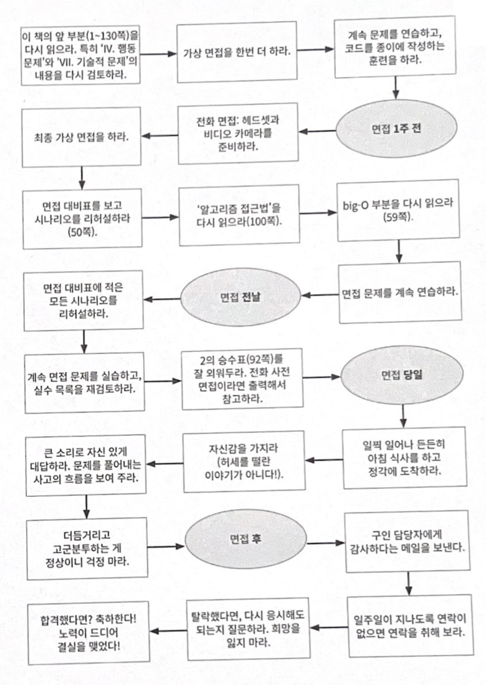

# 이력서 가이드

# 🏃🏼 적절한 경험 쌓기

- 훌륭한 경험 쌓기
    - 코딩을 많이 할 수 있는 업무 하기
        - 대형 프로젝트, 관련 기술을 많이 사용할 수 있는 프로젝트
    - 저녁과 주말을 활용해서 토이 프로젝트 진행하기
- +++
- 공고에 지원해 보며 면접 경험 쌓기
- 개선 사항 찾아보기
- AsIs - ToBe 수치화 정리

# 📝 탄탄한 이력서 작성하기

적절한 이력서 길이

- 미국에서는 경력이 십 년 미만인 경우 이력서를 `한 페이지`로 만들도록 권장한다.
- 이력서는 짧으면 짧을수록 인상에 남는다.
    - 인상적인 항목만 적혀 있다면 반드시 볼 것이다.
    - 그렇지 않은 항목들은 보는 사람의 주의를 산만하게 만들 뿐이다.
    - 어떤 사람은 긴 이력서를 아예 무시해 버리기도 한다.
    - 이력서가 길다고 경험이 많다는 사실을 나타내지 않는다.

**고용 이력**

- 인상적으로 보이려면 “ `Y를 구현서 X를 성취했고, 그 결과 Z를 이루었다.`”는 사례를 들자.
    - 분산 캐시를 구현해서 오브젝트 렌더링 시간을 75% 줄였고, 그 결과 로그인 시간을 10% 경감할 수 있었다.
    - windiff에 기반한 새로운 비교 알고리즘을 구현한 결과, 평균 비교 정확도를 1.2에서 1.5로 개선했다.
- `무엇을` 했는지, `어떻게` 했는지, 그리고 `결과는` 어떠하였는지 적어 보자.
- 결과를 가급적 `측정 가능한` 형태로 제시하자.

**프로젝트**

- 가장 중요했던 2~4개의 프로젝트
    - 설명, 언어, 기술, 개인/팀
- 너무 많이 적는 것은 피하자
    - 작고 인상적이지 않은 프로젝트도 채워지게 된다

**프로그래밍 언어**

- 사용해 봤던 언어 전부를 적는 것은 위험할 수 있다.
    - 많은 면접관들이 이력서에 적혀있는 어떤 것이든 면접에서 물어볼 수 있다고 생각하기 때문이다.
- 가능하면 사용했던 모든 언어를 적되, 언어에 대한 `숙련도`도 함께 적자
    - 프로그래밍 언어: 자바(전문가), C++(능숙), JavaScript(경험 있음) → 색상적용?
- 특정 언어를 몇 년 동안 사용했는지는 애매한 면이 있어서 사용한 기간을 이력서에 적는 것은 좋지 않은 방법이다.
- 특정 언어를 사용하는게 낙인이 될 수 있다.
    - 한두 가지 언어에만 능숙하다면, 다양한 언어로 애플리케이션을 만들어 보자.
    

**준비 절차**

