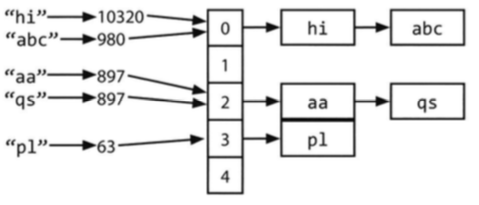

# Array and String

## ✅ HashTable

> 효율적인 탐색을 위한 자료구조로 key를 value에 대응
> 

간단한 해시테이블 구현을 위해 연결리스트(linked list)와 해시 코드 함수(hash code function)만 있으면 된다.

키와 값을 해시테이블에 넣을 때는 다음의 과정을 거친다.

1. 키의 해시 코드를 계산
    - 키의 자료형은 보통 int 혹은 long
    - 키의 개수는 무한한데 int 개수는 유한하므로 서로 다른 두 개의 키가 같은 해시 코드를 가리킬 수 있다.
2. 해시 코드를 이용해 배열의 인덱스 구하기
    - 해시 코드는 `hash(key) % array_length` 와 같은 방식
    - 서로 다른 두 개의 해시 코드가 같은 인덱스를 가리킬 수도 있다.
3. 배열의 각 인덱스에는 키와 값으로 이루어진 연결리스트가 존재
    - 충돌을 대비하여 반드시 연결리스트를 이용
    - 충돌이란 서로 다른 두개의 키가 같은 해시 코드를 가리키거나 서로 다른 두 개의 해시 코드가 같은 인덱스를 가리키는 경우

키에 상응하는 값을 찾기 위한 방법

1. 주어진 키로부터 해시 코드 계산하기
2. 이 해시 코드를 이용해 인덱스 계산하기
3. 해당 키에 상응하는 값을 연결리스트에서 탐색

충돌이 자주 발생한다면, 최악의 경우의 수행 시간 $O(N)$

하지만, 일반적으로 해시에 대해 이야기할 때는 충돌을 최소화하도록 잘 구현된 경우 $O(1)$



## ✅ ArrayList

> 동적 가변 크기 기능이 내재되어 있는 배열과 비슷한 자료구조를 원할 때 보통 ArrayList 를 사용한다.
> 

ArrayList 는 필요에 따라 크기를 변화시킬 수 있으면서도 $O(1)$ 접근 시간을 유지.

- 통상적으로 배열이 가득 차는 순간, 배열의 크기를 두 배로 늘린다.
- 크기를 두 배 늘리는 시간은 $O(n)$ 이지만, 자주 발생하는 일은 아니다.
- 상환 입력 시간으로 계산했을 때 $O(1)$ 이 된다.

```java
ArrayList merge(String[] words, String[] more) {
	ArrayList sentence = new ArrayList();
	for (String w : words) sentence.add(w);
	for (String w : more) sentence.add(w);
	return sentence;
}
```

## ✅ StringBuilder

문자열을 하나로 이어붙이려면 수행 시간은 어떻게 될까?

```java
String joinWords(String[] words) {
	String sentence = "";
	for (String w : words) {
		sentence = sentence + w;
	}
	return sentence;
}
```

문자열을 이어붙일 때마다 두 개의 문자열을 읽어 들인 뒤 문자를 하나한 새로운 문자열에 복사해야 한다.

- 처음에는 x개, 두 번째는 2x개, 세 번째는 3x개 .. n 번째는 nx 개
- 총 수행시간 $O(x + 2x + ... + nx) = O(xn^2)$

StringBuilder 가 이 문제를 해결해 줄 수 있다.

- 단순하게 가변 크기 배열을 이용해서 필요한 경우에만 문자열을 복사하게끔 해준다.

```java
String joinWords(String[] words) {
	StringBuilder sentence = new StringBuilder();
	for (String w : words) {
		sentence.append(w);
	}
	return sentence.toString();
}
```