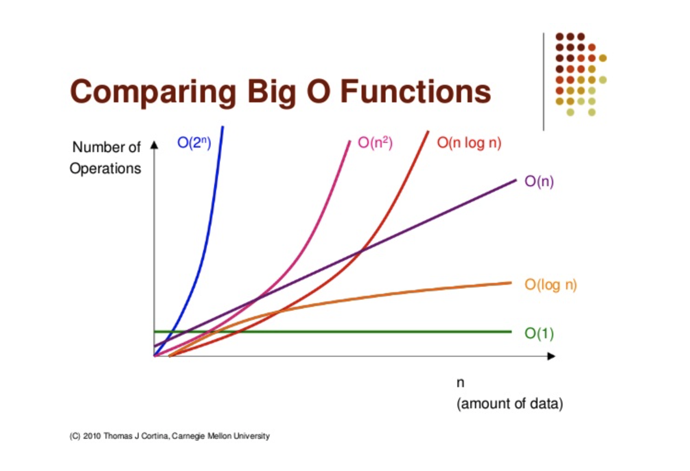
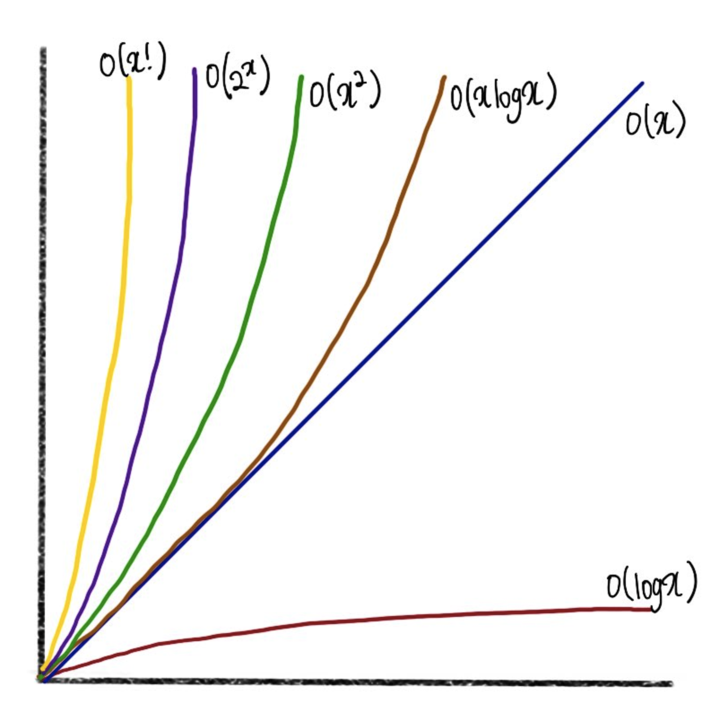

# Big-O

<aside>
💡 big-O 시간은 알고리즘의 효율성을 나타내는 지표 혹은 언어이다.
</aside>

# 시간 복잡도

> 점근적 실행 시간(asymptotic runtime), 또는 big-O 시간에 대한 개념
> 

데이터 전송 알고리즘의 실행 시간을 다음과 같이 설명할 수 있다.

- 온라인 전송
    - O(s). 여기서 s는 파일의 크기
    - 즉, 파일의 크기가 증가함에 따라 전송 시간 또한 선형적으로 증가한다.
- 비행기를 통한 전송
    - 파일 크기에 관계없이 O(1).
    - 파일의 크기가 증가한다고 해서 파일을 전송하는 데 걸리는 시간이 늘어나지 않는다.

다양한 종류의 실행 시간이 존재한다.



# **최선의 경우, 최악의 경우, 평균적인 경우**

> 알고리즘의 수행 시간을 세 가지 다른 방법으로 나타낼 수 있다. (퀵 정렬 관점으로 보자.)
> 

**최선의 경우**

- 만약 모든 원소가 동일하다면 퀵 정렬은 평균적으로 단순히 배열을 한 차례 순회하고 끝날 것이다. $O(N)$

**최악의 경우**

- 배열에서 가장 큰 원소가 계속해서 축이 될 경우 $O(N^2)$

평균적인 경우

- $O(NlogN)$

# 공간 복잡도

> 알고리즘에서는 시간뿐 아니라 메모리(혹은 공간) 또한 신경 써야 한다.
> 

공간 복잡도는 시간 복잡도와 평행선을 달리는 개념이다.

- 크기가 n인 배열을 만들고자 한다면, $O(n)$의 공간이 필요하다.
- n X n 크기의 2차원 배열을 만들고자 한다면 $O(n^2)$의 공간이 필요하다.

예시 1. 시간 복잡도: $O(n)$, 공간 복잡도: $O(n)$

```java
int sum(int n) {
	if (n <= 0) {
		return 0;
	}
	return n + sum(n-1);
}

...

sum(4)
 -> sum(3)
   -> sum(2)
     -> sum(1)
       -> sum(0)
```

예시 2. $O(n)$번 호출했지만, 함수들이 호출 스택에 동시에 존재하지 않으므로 $O(1)$ 공간만 사용

```java
int pairSumSequence(int n) {
	int sum = 0;
	for (int i = 0; i < n; i++) {
		sum += pairSum(i, i + 1);
	}
	return sum;
}

int pairSum(int a, int b) {
	return a + b;
}
```

# 상수항

> bog-O는 단순히 증가하는 비율을 나타내는 개념이므로 `수행 시간에서 상수항을 무시`해 버린다.
> 

즉, $O(2N)$으로 표기되어야 할 알고리즘을 실제로는 $O(N)$으로 표기한다.

big-O 표기법은 `수행 시간이 어떻게 변하는지를 표현해주는 도구`이다.

- 따라서 $O(N)$이 언제나 $O(2N)$보다 나은 것은 아니라는 사실을 받아들이자.

# 지배적이지 않은 항

> 수식에서 지배적이지 않은 항은 무시해도 된다.
> 
- $O(N^2 + N)$은 $O(N^2)$이 된다.
- $O(N + logN)$은 $O(N)$이 된다.
- $O(5*2^N + 1000N^{100})$은 $O(2^N)$이 된다.



# 여러 부분으로 이루어진 알고리즘

> 어떤 알고리즘이 두 단계로 이루어져 있다면 수행 시간을 어떻게 계산할까?
> 

“A 일을 모두 끝마친 후에 B 일을 수행하라”

- A 와 B 의 수행 시간을 더해야($+$) 한다.

“A 일을 할 때마다 B 일을 수행하라”

- A 와 B 의 수행 시간을 곱해야($X$) 한다.

# $logN$ 수행시간

> 어떤 문제에서 원소의 개수가 절반씩 줄어든다면 그 문제의 수행 시간은 $O(logN)$이 될 가능성이 크다.
> 

ex. 균형 이진 탐색 트리(balanced binary search tree)

- 매 단계마다 원소의 대소를 비교한 뒤 왼쪽 혹은 오른쪽으로 내려간다.
- 각 단계에서 검색해야 할 노드의 개수가 절반씩 줄어들게 되므로, 문제 공간또한 절반씩 줄어든다.

# 재귀적으로 수행 시간 구하기

> 다수의 호출로 이루어진 재귀 함수에서 수행 시간은 보통 $O(분기^{깊이})$로 표현되곤 한다.
> 

분기: 재귀 함수가 자신을 재호출하는 횟수