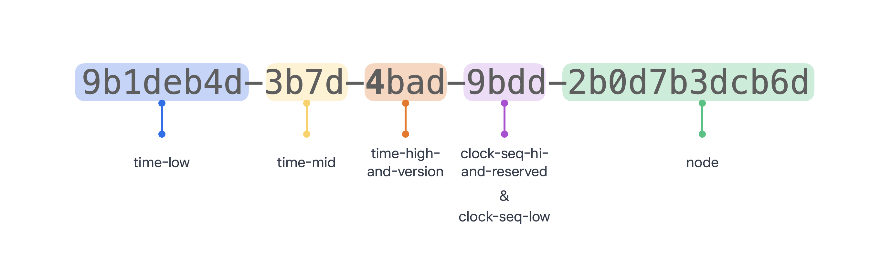

# UUID

## UUID란?

- Universally Unique Identifier
- 128 bit 고유 식별자
- 네트워크 상에서 서로 모르는 개체들을 식별하고 구별하기 위한 고유 이름이 필요함.
- 개발 주체가 스스로 이름을 짓되 고유성을 충족하는 방법
- 중앙 발급 시스템 없이 상대적으로 더 빠르고 간단하게 만들 수 있음.
- 완벽한 고유성을 보장하진 않음 (10억 분의 1)

### UUID 구조

- 128bit
- 36 length
- 32개의 16진수
- 8-4-4-4-12



| 필드 | 사이즈 | 설명 |
| --- | --- | --- |
| time-low | 4hexOctet / 32bit | 타임스탬프의 low field |
| time-mid | 2hexOctet / 16bit | 타임스탬프의 mid field |
| time-high-and-version | 2hexOctet / 16bit | 타임스탬프의 high field & UUID 버전 |
| clock-seq-hi-and-reserved | hexOctet / 8bit | 클락 시퀀스의 high field & variant |
| clock-seq-low | hexOctet / 8bit | 클락 시퀀스의 low field |
| node | 6hexOctet / 48bit | node 식별자 |

| 버전 | 설명 | 특징 |
| --- | --- | --- |
| UUID Version1 | 해당 버전은 “현재 시간”과 “랜덤한 MAC 주소”를 기반으로 생성됩니다. | 유일성이 보장되지만 보안에 취약함. |
| UUID Version2 | 해당 버전은 이전 버전 1과 유사하지만 시퀀스 번호 대신 POSIX UID(사용자 ID)를 사용하여 생성됩니다. | 현재는 거의 사용하지 않음. |
| UUID Version3 | 해당 버전은 해시 함수인 “MD5 해시”를 기반으로 이름과 네임스페이스에 대한 조합으로 생성됩니다. | 암호화 해시 함수를 사용하여 생성하므로 보안성이 높음.이름과 네임스페이스가 같으면 같은 UUID가 생성됩니다. |
| UUID Version4 | 해당 버전은 “랜덤한 값”을 기반으로 생성됩니다. | 보안성이 높고 생성속도가 빠릅니다. |
| UUID Version5 | 해당 버전은 이전 버전 3과 유사하지만 “SHA-1 해시”를 사용하여 생성됩니다. | 보안에 취약하다는 단점이 있습니다. |

**UUID 사용**

```java
import java.util.UUID;
/**
 * [공통함수] UUID v4를 생성합니다.
 *
 * @return
 */
public static UUID generateType4UUID() {
    // 버전 4 UUID 생성하기
    UUID uuid4 = UUID.randomUUID();
    System.out.println("Version 4 UUID: " + uuid4); // Version 4 UUID: c48b2aef-9d79-44fe-bd97-46fd31361069
    return uuid4;
}
```

참고

[범용 고유 식별자](https://ko.wikipedia.org/wiki/범용_고유_식별자)

[UUID(Universally Unique Identifier) | 토스페이먼츠 개발자센터](https://docs.tosspayments.com/resources/glossary/uuid)