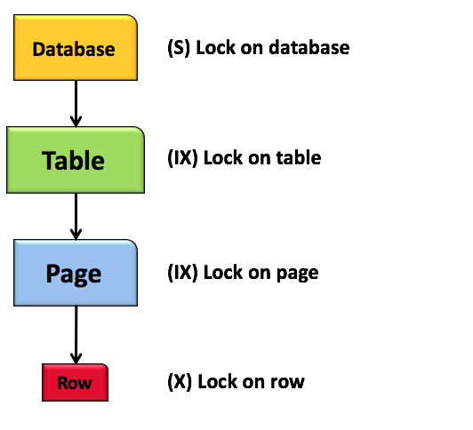
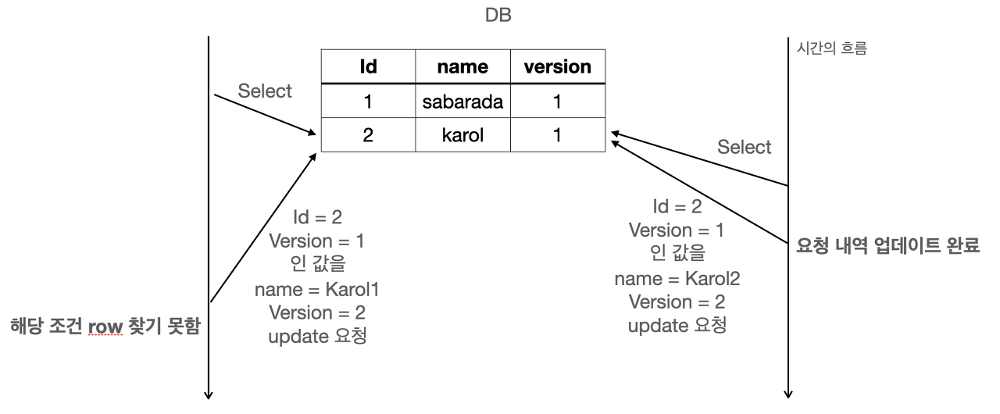

# 데이터베이스 락의 종류

[Why do we need Intent Locks in SQL Server?](https://www.sqlpassion.at/archive/2016/05/16/why-do-we-need-intent-locks-in-sql-server/)

[[Database] 데이터베이스 락(Lock)의 종류와 역할](https://velog.io/@koo8624/Database-데이터베이스-락Lock의-종류와-역할)

성능을 위해 데이터베이스에선 동시성 제어가 필수이기 때문에 동시에 수행되면서 데이터의 일관성을 해치지 않도록 락을 사용한다.

## **락의 레벨에 따른 분류**

**1) Shared Lock 공유 락 (S)**

- Read에 대해 주어지는 락 (Read Lock)
- 다른 트랜잭션에서의 공유락은 허용, 베타락은 허용하지 않음
- Read (O) Write(X)

**2) Exclusive Lock 베타 락**

- 다른 트랜잭션의 공유, 베타락 모두 불허
- Read(X), Write(X)

**3) Update Lock 업데이트 락**

- 데이터 수정 전 베타 락을 걸 때 데드락 방지를 위해 사용
- update where 과정에서 실행됨

**4) Intent Lock 내재 락**

- 사용자가 요청한 범위에 대한 락(ex, 테이블 락)을 걸 수 있는지 여부를 빠르게 파악하기 위해 사용되는 락

## 비관적 VS 낙관적

**1) Pessimistic Lock 비관적락**

- Repeatable Read, Serializable 수준
- 트랜잭션 실행 시 Shared Lock/Exclusive Lock 을 거는 방법

**2) Optimistic Lock 낙관적 락**

- Application Level 에서 잡아주는 Lock
- 쿼리 실행 시 다른 유저가 동일 조건으로 값을 수정할 수 없도록 걸어 두는 lock
- version column으로 관리

**3) 비교**

- 성능 낙관적 > 비관적
- 낙관적 락은 트랜잭션 단위가 아님
- 롤백할 때는 낙관적 < 비관적 (트랜잭션이 아니기 때문에)

1) 클라언트 → 서버 정보 요청

2) 서버 → 클라이어트 응답

3) 응답 토대로 클라이언트 → 서버 수정 요청

4) 서버에서 수정 적용 (충돌 감지)

[[database] 낙관적 락(Optimistic Lock)과 비관적 락(Pessimistic Lock)](https://sabarada.tistory.com/175)