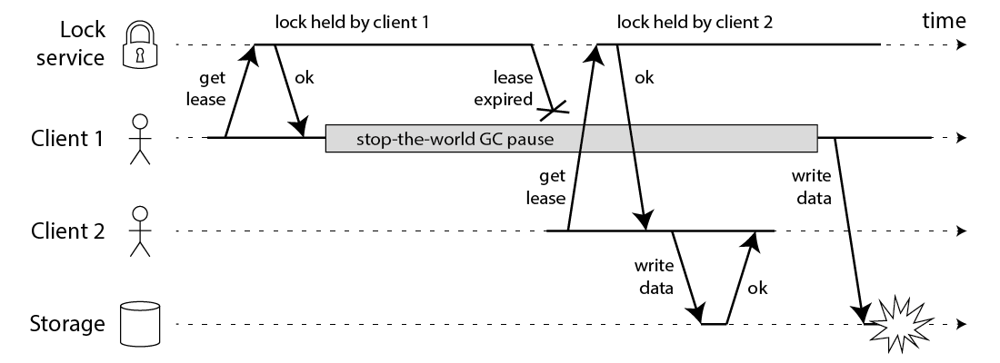
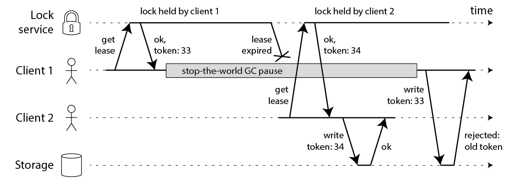

# 레디스 락의 문제점

[How to do distributed locking — Martin Kleppmann’s blog](https://martin.kleppmann.com/2016/02/08/how-to-do-distributed-locking.html)

레디스를 사용하기 좋은 케이스

- 일시적인 케이스
- 빠른 응답속도에 대한 요구
- 엄밀한 정확성이 요구되지 않을 때
- ex) 어뷰징을 막기 위해 Ip 별 요청 카운터

왜 락을 사용하는가?

- 여러 노드가 똑같은 작업을 하려고 할 때 오직 하나만 제대로 완료할 수 있도록 하는 것
- 두 가지 중 어느 것을 위해 락을 사용하는 지 점검
    - 정확성
    - 효율성
- 락이 제대로 작동하지 않을 때를 고려
    - 정확성: 무결성이 깨지고 전체 시스템에 장애가 발생할 수 있다.
    - 효율성: 약간의 비용 증가

효율성에 대한 필요로 락을 사용한다 → 레드락 알고리즘을 사용하는 락을 쓸 필요가 없음

- 한 레디스나 Master + 복제 이렇게 두 대로 운영
- 이게 레디스의 취지와 가장 적합하다.

정확성에 대한 필요로 락을 사용한다면 → 레드락

락의 한계점

```java
// THIS CODE IS BROKEN
function writeData(filename, data) {
    var lock = lockService.acquireLock(filename);
    if (!lock) {
        throw 'Failed to acquire lock';
    }

    try {
        var file = storage.readFile(filename);
        var updated = updateContents(file, data);
        storage.writeFile(filename, updated);
    } finally {
        lock.release();
    }
}
```



- gc pause가 나면 락을 쓰더라도 동시성 이슈가 발생할 수 있다.
- jvm을 쓰지 않더라도 네트워크 지연으로도 비슷한 이슈가 발생할 수 있다.
    - 유명한 깃헙 장애 ([https://github.blog/2012-12-26-downtime-last-saturday/](https://github.blog/2012-12-26-downtime-last-saturday/))
    - 쓰기 락을 획득했던 write request가 키가 만료된 이후에 실제 스토리지 서버 가서 변경 작업

해결 방법: fencing  토큰 (울타리 토큰)



- 대신 스토리지가 직접 토큰 값을 확인해야한다는 점이 있다.
- 이것도 여전히 한계가 존재: 레드락에는 없는 방법이고, 분산환경에서 카운터를 사용한다는거 자체가 어렵다.

두 번째: clock의 부정확성

1) 클라이언트 1이 노드 A, B, C에서 잠금을 획득하지만, 네트워크 문제로 인해 D와 E에서는 잠금 획득에 실패한다.
2) 이때 노드 C의 시계가 앞으로 이동하여 잠금이 만료된다.
3) 클라이언트 2가 노드 C, D, E에서 잠금을 획득하지만, 네트워크 문제로 인해 A와 B에서는 잠금 획득에 실패한다.
4) 이제 클라이언트 1과 2는 모두 자신이 잠금을 획득했다고 믿는다.

저자의 주장: 정확성이 요구되는 분산락에선 레드락 말고 주키퍼 써라.

[Distributed Locks with Redis](https://redis.io/docs/latest/develop/use/patterns/distributed-locks/)