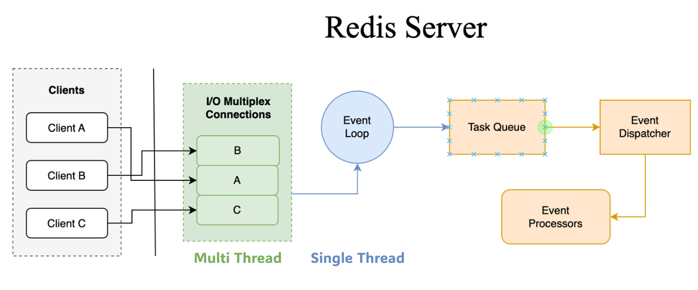
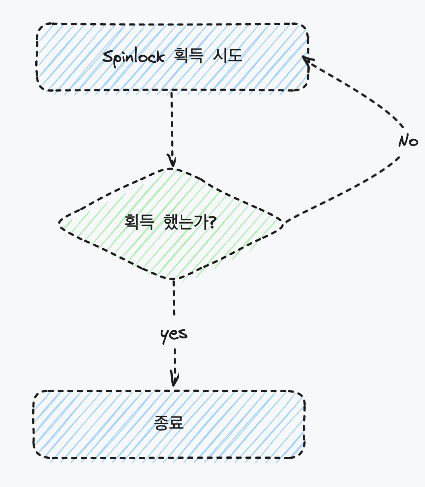

# 레디스 분산락

항상 생각할 포인트

- 필요한 기능 대비 들어가는 자원의 효율성
    - 개발 공수
    - 운영 인력
    - ~~인프라 비용~~

를 고려해서 어떤 방식이 최적인지 (늘 최고의 기술을 고집하지 마라)

따닥을 방지법

- DB 칼럼 넣기
- 멱등키
- 레디스 분산 락
- 스프링 transactional

락의 종류

- 낙관적 락 (optimistic lock)
- 비관적 락 (pessimistic lock)

[Optimistic Locking in JPA | Baeldung](https://www.baeldung.com/jpa-optimistic-locking)

레디스는 싱글 스레드이기 때문에 여러 서버 인스턴스로 운영하는 분산환경에서는 **여러 서버 인스턴스로** **동일한 요청을** 처리하는 것을 방지하기 위해 레디스 분산락을 사용할 수 있다. (낙관 락)




Redis SETNX

중복 요청을 exception 처리할 때

```java
var ops = redisTemplate.opsForValue();
Boolean isFirstRequest = ops.setIfAbsent("lock:" + dlvNo, "true", 10, TimeUnit.SECONDS);

if (!isFirstRequest) {
	throw new DuplicateRequestException();
}
```

공통 자원에 대해 락을 획득하게 하도록 하는 방식 (spin lock)



```java
void doProcess() {
    String lockKey = "lock";

    try {
        while (!tryLock(lockKey)) { // (2)
        //try 구문 안에서 락을 획득할때까지 계속 락 획득을 시도합니다. 그리고 혹시라도 레디스에 너무 많은 요청이 가지 않도록 약간의 sleep을 걸어줬습니다.

            try {
                Thread.sleep(50);
            } catch (InterruptedException e) {
                throw new RuntimeException(e);
            }
        }
        
        // (3) 락을 획득한 후에 연산을 수행합니다.
    } finally {
        unlock(lockKey); // (4) 락을 사용 후에는 꼭 해제하도록 finally에서 락을 해제해줍니다.

    }
}

boolean tryLock(String key) {
    return command.setnx(key, "1"); // (1)
    //락을 획득한다는 것은 “락이 존재하는지 확인한다”, “존재하지 않는다면 락을 획득한다” 두 연산이 atomic하게 이루어져야합니다.

}

void unlock(String key) {
    command.del(key);
}

```

- key에 대한 타임아웃 없으면 무한 루프

https://www.youtube.com/watch?v=mPB2CZiAkKM