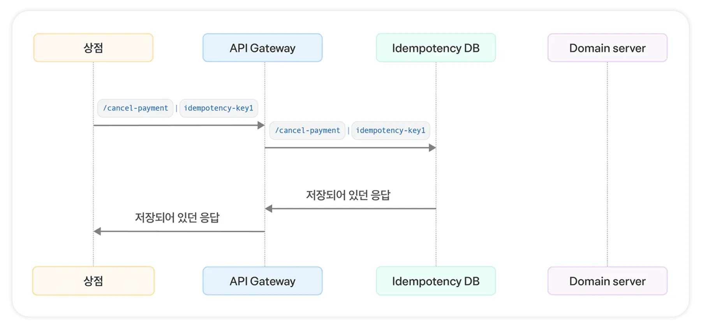

# 멱등키 (idempotent key)

[The Idempotency HTTP Header Field](https://datatracker.ietf.org/doc/html/draft-idempotency-header-01#section-2.7)

## **멱등성이란?**

- 연산을 여러 번 적용하더라도 결과가 달라지지 않는 성질

**CS 개념 중 같이 알아두면 좋은 것들**

- 참조 투명성
- 재진입성
- 함수형 프로그래밍

## **API가 멱등하다는 것은?**

- 두 번 이상 요청해도 결과는 처음 요청과 똑같이 응답한다.
- 응답 값이 같을 뿐 아니라 서버 상태, DB도 영향을 받지 않는 것.
- 결함 없고 안전한 API를 만드는데 멱등성은 중요한 개념

**멱등성을 보장하는 API 구현 방법**

- Http 헤더에 멱등키를 포함
    
    
    

**순서도**

- 요청마다 헤더에 멱등키 확인
- 멱등키 저장 DB에 존재하는 키인지 확인
    - 저장 기간 설정 가능
- 존재하는 키라면 저장되었던 응답 반환 , 서버에 재요청하지 않음
- 키가 없다면 새로운 기록을 만들고 응답을 클라이언트 에게 전달

장점

- 타임아웃 처리가 확실해진다.
- 키로 멱등적인 처리가 되었는지 확인 가능하다.
- 퍼포먼스

## **에러 처리**

**1. 400 Bad Request**

- 멱등성 API 요청에 멱등키가 누락
- 형식에 맞지 않는 키 값

**2. 409 Conflict**

- 이전 요청 처리 진행중 같은 멱등키로 새로운 요청

1. **422 Unprocessable Entity**
- 재시도된 요청 payload에 처음 요청과 다른데 같은 멱등키

[참조 투명성](https://ko.wikipedia.org/wiki/참조_투명성)

[재진입성](https://ko.wikipedia.org/wiki/재진입성)

[API idempotency | Adyen Docs](https://docs.adyen.com/development-resources/api-idempotency/)

진짜로 적용해보자.

1. 키를 어디서 만드냐 (누가)
2. 어떻게 만드냐 (키 값을 어떻게 만드냐 → 우리가 의도하는대로 작동하게 할려면)