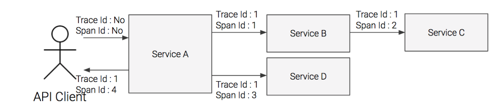
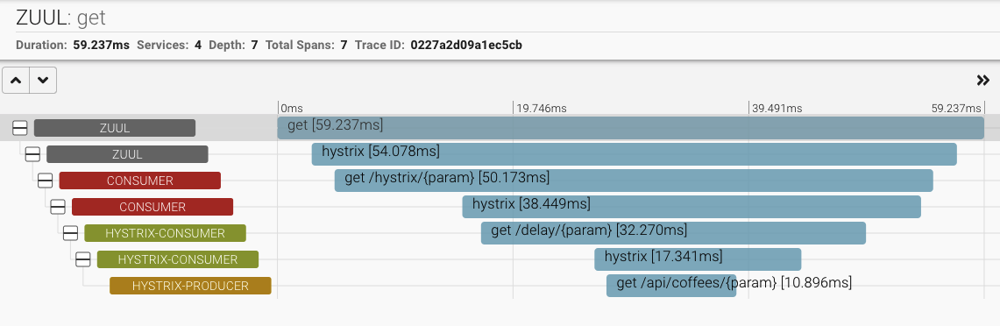
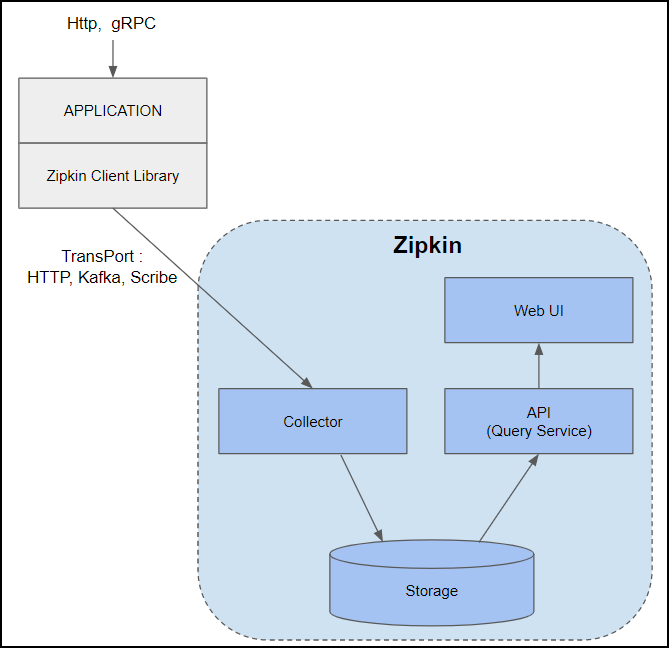

# Spring Cloud Sleuth & Zipkin

- Sleuth는 분산된 마이크로서비스간에 트래픽의 흐름을 추적(Tracing)할 수 있도록 
Trace기록을 로그에 자동 삽입
- **동일한 트랙잰션에 해당하는 트래픽들에 동일한 TraceID를 부여**
- [Service명, Trace ID, Span ID]
    - service: 현재 application
    - 트랜잭션의 traceID
    - 현재 서비스 내에서의 ID

순서에 대한 정보는 4가지 종류의 timestamp로 소요 시간까지 측정

- CS(Client Start) -> SR(Server Received) => SS(Server Sent) => CR(Client Received)

Zipkin: 분산 트랜잭션 추적 시스템

- 각 클라이언트에서 Zipkin client로 보내기

Jaeger, Zipkin

- Zipkin client library: 각 어플리케이션에 설치되어 Zipkin collector로 Trace정보를 송부함
- Collector: Trace정보 수집기
- Storge: In-memory(테스트 목적), 소규모는 MySQL, 운영환경에는 ElasticSearch나 Cassandra를 사용
- API(Query Service): Web UI의 요청을 받아 Storage를 검색하여 결과를 리턴
- Web UI: 대시보드 UI 제공